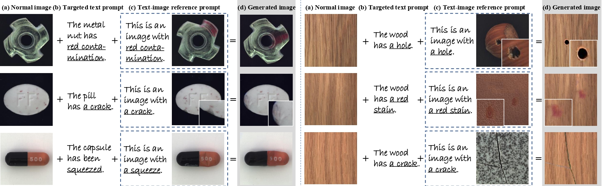
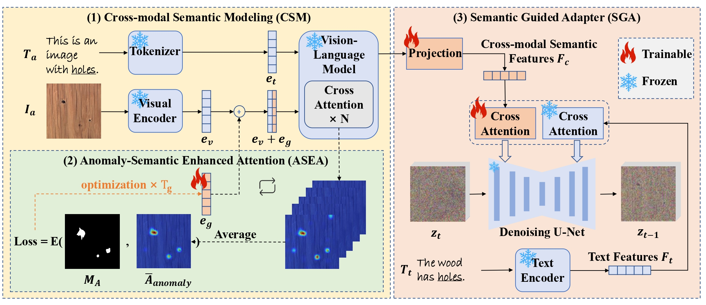

<h1 align="center">AnomalyControl: Learning Cross-modal Semantic Features for Controllable Anomaly Synthesis</h1>

<p align="center">
  <strong>Shidan He</strong><sup>1,2</sup> &nbsp;&nbsp;
  <strong>Lei Liu</strong><sup>3</sup> &nbsp;&nbsp;
  <strong>Xiujun Shu</strong><sup>2</sup> &nbsp;&nbsp;
  <strong>Bo Wang</strong><sup>2</sup> &nbsp;&nbsp;
  <strong>Yuanhao Feng</strong><sup>2</sup> &nbsp;&nbsp;
  <strong>Shen Zhao</strong><sup>1</sup>
</p>

<p align="center">
  <sup>1</sup>Sun Yat-sen University &nbsp;&nbsp;|&nbsp;&nbsp;
  <sup>2</sup>Tencent, WeChat Pay &nbsp;&nbsp;|&nbsp;&nbsp;
  <sup>3</sup>Ant Group
</p>

<p align="center">
  <a href="https://arxiv.org/abs/2412.06510">
    
  </a>
</p>


<div  align="center">    
 
</div>

<!-- ⭐ Our method introduces a novel **cross-modal control framework** for anomaly synthesis, combining **visual** and **textual descriptors** to guide the diffusion model with **fine-grained semantic priors**. -->

<p>
⭐ Our method learns <strong>cross-modal semantic features</strong> as the priors to achieve both <strong>realism</strong> and <strong>generalization</strong> for controllable anomaly synthesis. <br><br>
<strong>Realism:</strong> The targeted text prompt provides a full description for the targeted anomaly image (<em>e.g.</em>, color, texture, and shape), while the text-image reference prompt provides a template for the targeted anomaly region (<em>e.g.</em>, magnified area). <br>
<strong>Generalization:</strong> The text-image reference can exhibit a different material surface compared with the targeted text prompt (<em>e.g.</em>, the right examples).
</p>

# 🙂 Overview
<div  align="center">    
 
</div>

🔍 **Pipeline of the proposed AnomalyControl**  
Our framework consists of three modules to enhance controllability in anomaly synthesis:

1. 🧠 **CSM (Cross-modal Semantic Modeling)**  
   Integrates both visual and textual anomaly descriptors (`I_a`, `T_a`) to capture precise cross-modal semantic features using a frozen VLM.

2. 🎯 **ASEA (Anomaly-Semantic Enhanced Attention)**  
   Employs a trainable attention guidance variable `e_g` to emphasize the designated anomaly regions, capturing more accurate semantic information **without** retraining the frozen VLM.

3. 🧩 **SGA (Semantic Guided Adapter)**  
   Utilizes a decoupled cross-attention mechanism to inject semantic priors into the diffusion model, enabling **flexible** and **generalized** anomaly generation.

# 🛠️ Data Preprocess
🚧 **Coming soon...**

# 🚀 Run
🚧 **Coming soon...**

# ✋ Inference
🚧 **Coming soon...**

# License
MIT License

# Citation
If you find our work useful in your research, please consider citing: 
```
@article{he2024anomalycontrol,
  title={Anomalycontrol: Learning cross-modal semantic features for controllable anomaly synthesis},
  author={He, Shidan and Liu, Lei and Shu, Xiujun and Wang, Bo and Feng, Yuanhao and Zhao, Shen},
  journal={arXiv preprint arXiv:2412.06510},
  year={2024}
}
```

# Acknowledgement
Thanks to the following excellent works: [IP-Adapter](https://github.com/tencent-ailab/IP-Adapter), [AnomalyDiffusion](https://github.com/sjtuplayer/anomalydiffusion).